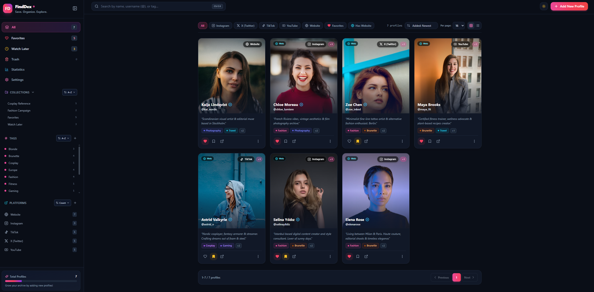
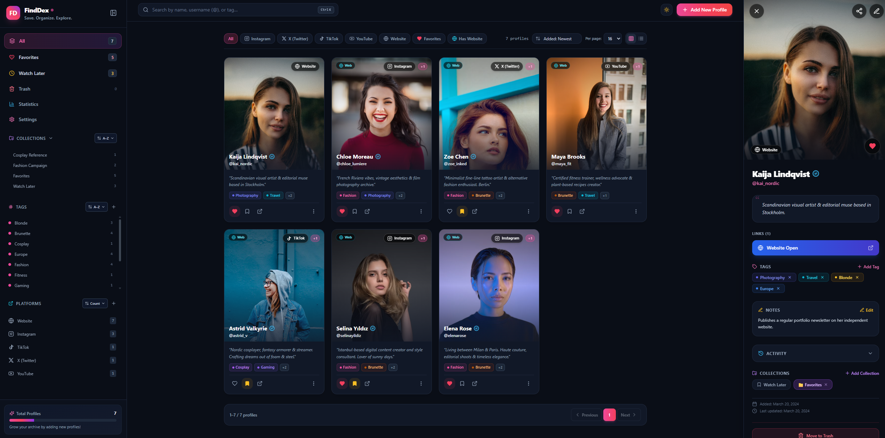
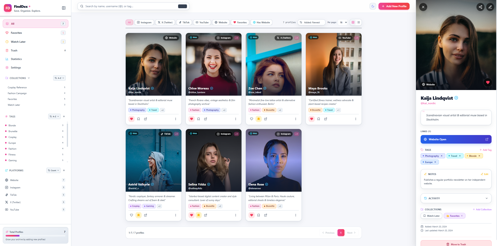

# FindDex

[🇬🇧 English README](README.md)

Sosyal medyada her gün hatırlamak isteyeceğimiz onlarca insanla karşılaşıyoruz: harika bir tarif paylaşan bir aşçı, gitmek istediğimiz yerleri fotoğraflayan bir gezgin ya da işleri yeni bir fikir veren bir tasarımcı. Gönderiyi beğeniyor, bazen hesabı takip ediyoruz. Fakat haftalar sonra yeniden bulmak istediğimizde kullanıcı adı çoktan aklımızdan çıkmış oluyor. Hatırladığımız tek şey “şu tarif videosunu çeken kişi.” Algoritma profili bir daha karşımıza getirmiyor; hesap, takip ettiğimiz yüzlerce kişi arasında kaybolup gidiyor.

FindDex, gelip geçen bu keşifleri kendi aranabilir hafızanıza dönüştürür. İlginç bir profili saniyeler içinde kaydedebilir, neden dikkatinizi çektiğini not edebilir, anlamlı etiket ve koleksiyonlarla düzenleyebilirsiniz. Aylar sonra tam kullanıcı adını hatırlamasanız bile aradığınız kişiye yeniden ulaşabilirsiniz. FindDex, internette keşfettiğiniz insan ve fikirler için size ait, özel ve aranabilir bir arşivdir.

**Nasıl çalışır:** FindDex; Next.js, Prisma ve SQLite ile geliştirilmiş, kendi sunucunuzda çalışan tek kullanıcılı bir uygulamadır. Veritabanını ve yüklenen görselleri kendi dosya sisteminizde saklar ve tek bir Docker Compose servisi olarak çalışır.

## Özellikler

- Çoklu platform bağlantıları, etiketler, koleksiyonlar, notlar ve favoriler içeren profiller
- Çoklu görsel galerisi, kapak seçimi, kart üzerinde gezinme ve tam ekran lightbox
- Mükerrer kayıt tespiti, soft-delete çöp kutusu ve profil aktivite geçmişi
- Sunucu taraflı sayfalama ve toplu istatistik paneli
- Yüklenen görselleri de kapsayan JSON/ZIP içe ve dışa aktarma
- Otomatik ve rotasyonlu JSON yedekleri
- Sayfa yenilemeden geçiş yapılabilen İngilizce ve Türkçe arayüz
- Instagram profillerini ve gönderi thumbnail'lerini kaydeden Chrome eklentisi
- Kalıcı SQLite ve görsel depolama sağlayan Docker kurulumu

## Ekran görüntüleri

### Ana görünüm



### Profil detay paneli



### Açık ve koyu temalar



## Gereksinimler

- Docker Engine
- Docker Compose v2
- Kalıcı veri ve yüklenen görseller için yazılabilir iki depolama konumu

## Hızlı başlangıç

```bash
cp .env.example .env
docker compose up -d --build
```

FindDex varsayılan olarak `http://localhost:12000` adresinde açılır. Farklı bir host portu kullanmak için `.env` içindeki `APP_PORT` değerini değiştirin.

Yararlı komutlar:

```bash
docker compose logs -f app
docker compose down
```

`docker compose down`, container'ı ve Compose ağını kaldırır ancak kalıcı verilere dokunmaz. Docker tarafından yönetilen volume'ları bilinçli olarak silmek istemediğiniz sürece `docker compose down -v` kullanmayın.

## Depolama yapılandırması

FindDex iki kalıcı mount kullanır:

| Host konumu | Container konumu | Amaç |
| --- | --- | --- |
| `/path/to/finddex-data` | `/app/data` | SQLite veritabanı ve otomatik yedekler |
| `/path/to/finddex-uploads` | `/app/public/uploads` | Yüklenen görseller |

`/path/to/finddex-data` ve `/path/to/finddex-uploads` değerlerini kendi sisteminizdeki kalıcı depolama konumlarıyla değiştirin. `.env` dosyanızdaki `MODELVAULT_DATA_DIR` ve `MODELVAULT_UPLOADS_DIR` değerlerini bu yolları gösterecek şekilde ayarlayın:

```dotenv
APP_PORT=12000
MODELVAULT_DATA_DIR=/path/to/finddex-data
MODELVAULT_UPLOADS_DIR=/path/to/finddex-uploads
PUID=1000
PGID=1000
DATABASE_URL=file:./dev.db?connection_limit=1&socket_timeout=30
```

Eski `MODELVAULT_DATA_DIR` ve `MODELVAULT_UPLOADS_DIR` değişken adları, FindDex isim değişikliğinden sonra mevcut kurulumların veri bağlantısının kopmaması için bilinçli olarak korunur. Host yolu kullanmak istemiyorsanız Docker tarafından yönetilen `modelvault_data` ve `modelvault_uploads` varsayılan değerlerini de kullanabilirsiniz.

Otomatik yedekler `/app/data/backups` altında tutulur. Bu konum zaten veri mount'unun içinde olduğundan ayrı bir volume gerekmez.

Linux veya macOS hostunda bind mount klasörleri için izin hatası alırsanız klasör sahibini `.env` içindeki `PUID` ve `PGID` değerleriyle eşleştirin. Örneğin: `sudo chown -R 1000:1000 /path/to/finddex-data /path/to/finddex-uploads`. Docker Desktop kurulumlarında bu adıma genellikle gerek yoktur.

## Temiz kurulum

1. `.env.example` dosyasını `.env` adıyla kopyalayın.
2. `.env` içindeki depolama yollarını sisteminizdeki kalıcı konumlarla değiştirin.
3. Bu klasörleri oluşturun. POSIX uyumlu bir shell kullanıyorsanız:

```bash
mkdir -p /path/to/finddex-data /path/to/finddex-uploads
```

4. FindDex'i başlatın:

```bash
docker compose up -d --build
docker compose logs -f app
```

FindDex her container başlangıcında SQLite'ı hazırlar, `prisma migrate deploy` komutunu uygular ve ardından Next.js'i başlatır. Yeni kurulum boş bir veritabanıyla açılır; demo içerik daha sonra **Ayarlar → Tehlikeli Bölge** üzerinden yüklenebilir.

## Mevcut veriyi taşıma

SQLite dosyasını yazma işlemi sırasında kopyalamamak için önce FindDex'i durdurun. Aşağıdaki tüm placeholder yollarını `.env` dosyanızda yapılandırdığınız konumlarla değiştirin:

```bash
docker compose down
mkdir -p /path/to/finddex-data /path/to/finddex-uploads
cp prisma/dev.db /path/to/finddex-data/dev.db
cp -a public/uploads/. /path/to/finddex-uploads/
cp /path/to/finddex-data/dev.db /path/to/finddex-data/dev.db.backup
docker compose up -d --build
```

Shell ortamınızda `cp` bulunmuyorsa aynı işlemi yapan yerel dosya kopyalama komutlarını kullanın. Bind mount sahipliğini uygulayan hostlarda container'ı başlatmadan önce depolama bölümündeki isteğe bağlı `chown` komutunu uygulayın.

FindDex hem yeni ve boş bir veritabanını hem de migration geçmişi olmayan Docker öncesi bir veritabanını otomatik olarak hazırlayabilir.

## Güncelleme

Daha yeni bir sürümü çektikten veya proje dosyalarını güncelledikten sonra:

```bash
docker compose up -d --build
docker compose logs -f app
```

Yeni Prisma migration'ları başlangıç sırasında otomatik uygulanır.

## Başka bir bilgisayara taşıma

Şunların tamamını kopyalayın:

1. Kaynak kod, `Dockerfile` ve `docker-compose.yml` dahil proje klasörü
2. `MODELVAULT_DATA_DIR` olarak yapılandırılan klasörün tamamı
3. `MODELVAULT_UPLOADS_DIR` olarak yapılandırılan klasörün tamamı
4. Bilgisayara özel `.env` dosyası

Hedef bilgisayardaki iki depolama yolunu `.env` içinde güncelleyin, gerekiyorsa izinleri doğrulayın ve `docker compose up -d --build` komutunu çalıştırın.

## Chrome eklentisi

1. `chrome://extensions` adresini açın.
2. Geliştirici modunu etkinleştirin.
3. **Paketlenmemiş öğe yükle** seçeneğine basıp `finddex-instagram-extension` klasörünü seçin.
4. Eklenti ayarlarından English veya Türkçe dilini seçin.
5. FindDex sunucu adresini ve **Ayarlar → API Erişimi** bölümünde oluşturduğunuz API anahtarını girin.

Eklenti sayfaları web uygulamasının localStorage alanını okuyamadığı için dil tercihini kendi `chrome.storage.local` alanında saklar.

## Docker olmadan geliştirme

```bash
npm install
npx prisma migrate dev
npm run dev
```

Yerel Prisma komutlarını çalıştırmadan önce `.env.example` dosyasını `.env` olarak kopyalayın.

## Katkıda bulunma

1. Tek bir amaca odaklanan branch oluşturun.
2. Arayüz metinlerini `locales/en.json` ve `locales/tr.json` içinde tutun; kaynak dil İngilizcedir.
3. Dile duyarlı çıktılar için `Intl.DateTimeFormat` ve `Intl.NumberFormat` kullanın.
4. Değişiklik göndermeden önce `npm run build` çalıştırın ve iki dili de test edin.
5. Migration planı olmadan mevcut Prisma modellerinin veya eski Docker volume'larının adını değiştirmeyin.

## Güvenlik

FindDex güvenilir, tek kullanıcılı bir ortam için tasarlanmıştır ve çok kullanıcılı kimlik doğrulama içermez. İnternetten erişilebilir olacaksa ters proxy, VPN veya başka bir erişim kontrol katmanıyla koruyun.
